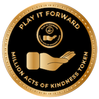

Play It Forward

"Million Acts Of Kindness" Token

PayItForward (PFWD)© is a decentralized digital token created by developers for developers. PlayItForward is used as a digital token to support open-source projects. It can also be used to support those who create `positive` and `meaningful` content, or simply anyone who deserves a helping-hand in achieving a greater good, for the benefit of their communities.

## Mission

- PlayItForward Token was founded by an entrepreneur software architect (`aka AvidCoder`), as a social experiment; not with the intention of trading for quick profits. It was created as the token `needed to exist`.
- PlayItForward's main intention is to be seen as a `“Million Acts Of Kindness”` Token.
- PlayItForward enables millions of micro-transactions targeting the right cause, potentially magnifying the impact in a positive way.

## PlayItForward Token Properties

- PlayItForward is pegged to USDC at a minimum value of $0.01 USDC per token, with a fixed supply of 1,000,000 tokens.
- PlayItForward's source code guarantees no more tokens can ever be created, making it a deflationary token by nature.
- PlayItForward's limited token supply makes its value increase over time due to possible scarcity.
- PlayItForward is a decentralized token, as it is secured by millions of computers worldwide on the Ethereum network.
- PlayForward can be used to store value due to its limited supply, making its upside unlimited.
- PlayItForward can be transferred in tiny fractional amounts, making it a great vehicle for micro-transactions.

## MORE INFO

### Whitepaper (PlayItForward `PFWD`)

- [Whitepaper](libs/agx-assets/src/lib/docs/PlayItForward.pdf)

### Website, Email

- info@playitforward.io
- [http://playitforward.io](http://playitforward.io)

### Social Networks

- PlayItForward on [Twitter](https://twitter.com/PlayItFWD_Token)
- PlayItForward on [Facebook](#) (launch soon ...)
- PlayItForward on [Discord](#) (launch soon ...)

### Token Info - Ethereum Network

- [Token Source Code](https://etherscan.io/address/0x20b19196dfa0454f142a38ea2e3b7077796de050#code) (Etherscan)
- [Token Address](https://etherscan.io/token/0x20b19196dfa0454f142a38ea2e3b7077796de050) (Etherscan)
- [Token Contract](https://etherscan.io/address/0x20b19196dfa0454f142a38ea2e3b7077796de050) (Etherscan)

### Token Info - Token Trackers Network

- PlayItForward on [CoinGecko](#) (launch soon ...)
- PlayItForward on [CoinMarketCap](#) (launch soon ...)

### Where to get PlayItForward Token

- Get PlayItForward `PFWD` Token on [Uniswap](https://app.uniswap.org/#/swap) 
  - Click on `Select A Token`
  - Click on `Manage Token List`
  - Click on `Token`
  - Copy & Paste the [Token Contract](https://etherscan.io/address/0x20b19196dfa0454f142a38ea2e3b7077796de050)
  - Select PlayItForward symbol `PFWD`
  - Select the other token you have
  - Click the amounts and swap

## DISCLOSURE (please read)

By owning PlayItForward Tokens, you acknowledge and agree that PlayItForward Tokens are not securities nor investment contracts. You also agree to hold the team harmless and not liable for any losses or taxes you may incur. Please note that PlayItForward is a community driven DeFi Ecosystem and not a registered digital currency, so please always make sure that you are in compliance with your local laws and regulations before you make any transaction. Digital tokens are not legal tender and not investments. Crypto market is highly risky and speculative in nature.
